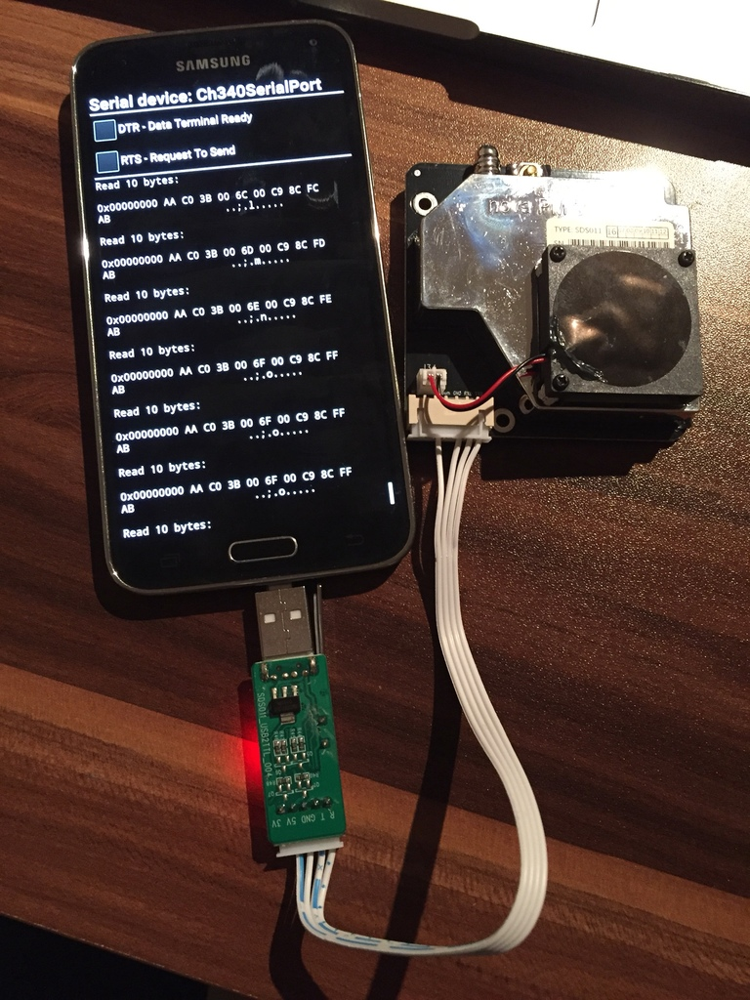

# SDS011_Android

## Materials

- Smartphone with USB host adapter [ebay](http://www.ebay.de/sch/i.html?_from=R40&_sacat=0&_nkw=samsung+s5&_dcat=9355&rt=nc&LH_ItemCondition=3000)
- CH340 USB [ebay](www.ebay.de/sch/i.html?_nkw=CH340+usb+ttl)
- OTG Adapter [ebay](http://www.ebay.de/itm/172231084022)

## Building instructions

1. Install Android studio
2. clone https://github.com/mik3y/usb-serial-for-android from github
3. run example app
4. connect sensor to smartphone

## Whishlist

- use serial api in background task
- parse SDS011 data
- send via mqtt to server